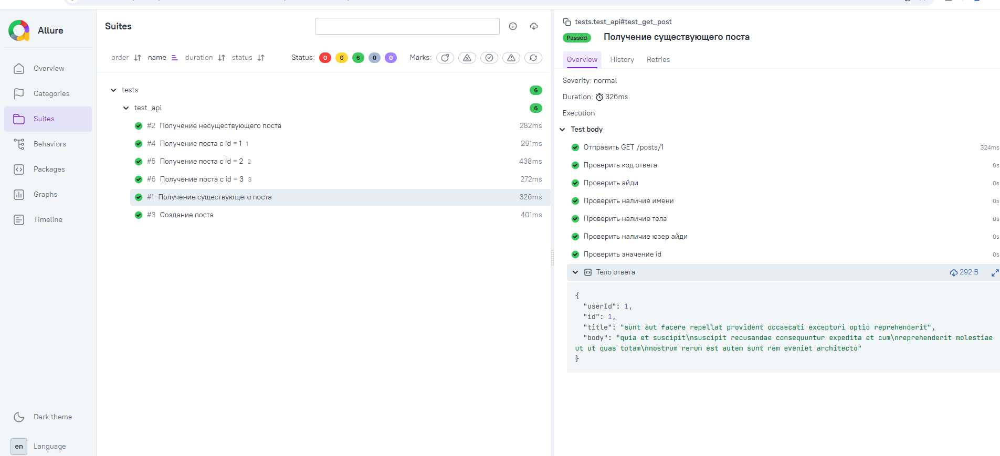

# QA Portfolio · Глеб Хряпин

Начинающий тестировщик, студент 4 курса по специальности «Информационные системы и программирование».
Здесь — автотесты, которые я пишу, осваивая автоматизацию.

## Что внутри

| Путь | Содержание |
|---|---|
| `tests/test_login.py` | UI-автотесты входа: позитивный сценарий и 4 негативных через параметризацию |
| `tests/test_api.py` | API-тесты: GET, проверка 404, POST с телом, параметризация |
| `pages/login_page.py` | Page Object страницы входа: локаторы и действия |
| `pages/inventory_page.py` | Page Object каталога товаров |
| `.github/workflows/tests.yml` | CI: прогон тестов при каждом пуше и pull request |
| `conftest.py` | Фикстура браузера: запуск и гарантированное закрытие |

## Стек

Python 3.13 · pytest · Selenium 4 · requests · Allure · GitHub Actions

## Как запустить

```bash
git clone https://github.com/gleb-khryapin/qa-portfolio.git
cd qa-portfolio
python -m venv venv
venv\Scripts\activate
pip install -r requirements.txt
pytest -v
```

## Отчёты Allure

Тесты размечены шагами, вложениями с телом ответа и группировкой по фичам:

```bash
pytest tests/ --alluredir=allure-results --clean-alluredir
allure serve allure-results
```



## Подход к тестам

- **Явные ожидания** `WebDriverWait` вместо пауз — тесты не «мигают» и не тратят время впустую
- **Page Object** — локаторы живут в классе страницы, тесты читаются как сценарий
- **Параметризация** — один тест проверяет несколько наборов данных, в отчёте видно, какой именно упал
- **Одно нарушение на проверку** — в негативных тестах нарушается ровно одно правило, иначе непонятно, что сработало

## Что умею в ручном тестировании

- Тест-кейсы и чек-листы: 39 кейсов на форму регистрации, чек-лист на 57 проверок с 21 найденным дефектом
- Баг-репорты с локализацией до фронтенда или бэкенда через DevTools
- Тест-план и применение шести техник тест-дизайна по документации REST API
- Postman, Swagger, SQL для проверки данных

# Ручное тестирование 

- Документы — в папке [manual-testing](manual-testing/).
- Отчёт по тестированию сайта "Бизон" 
- Отчёт по исследовательскому тестированию пробной версии "Saby"
- Тест кейсы по форме Регистрации Twitch
- Тест план Backend интернет-магазина ювелирных изделий

- Самостоятельно провёл все вышеперечисленные тесты, в ходе которых были применены различные техники дизайна
