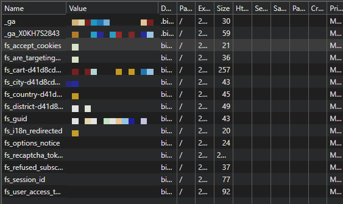
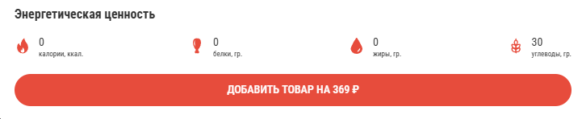
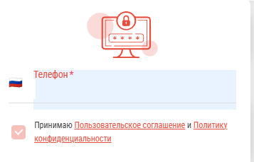

# 🐞 Баг-репорты: Бизон

**Продукт:** Бизон
**URL:** [БИЗОН | Кострома](https://bison44.ru/kostroma)
**Окружение:** Chrome 131.0.6778.86, Windows 11
**Дата:** 07.08.2026
**Автор:** Хряпин Г.С.

**Источник находок:** [чек-лист](checklist.md) — 21 дефект, здесь оформлены 3 лучших

---

## BUG-001 · Куки без флагов HttpOnly и Secure

**Заголовок:** Куки сессии `fs_session_id` и `fs_user_access_token` выставлены без флагов HttpOnly и Secure

**Окружение:**
Браузер: Chrome 131.0.6778.86
ОС: Windows 11
URL: https://bison44.ru/kostroma
Пользователь: авторизован
Дата: 07.08.2026

**Предусловия:**
Пользователь авторизован на сайте

**Шаги:**
1. Открыть DevTools (F12)
2. Перейти на вкладку Application
3. В разделе Storage выбрать категорию Cookies
4. Выбрать домен https://bison44.ru
5. Найти в списке куки `fs_session_id` и `fs_user_access_token`
6. Проверить колонки HttpOnly и Secure
7. Перейти на вкладку Console, выполнить `document.cookie`

**Ожидаемый результат:**
У кук `fs_session_id` и `fs_user_access_token` выставлены флаги HttpOnly и Secure. В выводе `document.cookie` эти куки отсутствуют.

**Фактический результат:**
Оба флага не выставлены. Обе куки присутствуют в выводе `document.cookie`, то есть доступны из JavaScript.

**Локализация:** бэкенд. Флаги `HttpOnly` и `Secure` выставляются сервером в заголовке ответа `Set-Cookie` при выдаче куки. Клиент на это влиять не может — `HttpOnly` по определению закрывает куку от JavaScript. Исправление в конфигурации сервера.

**Severity:** Major
**Priority:** Medium

**Обоснование severity/priority:**
Severity Major потому что функция работает неверно, нет обходного пути, но не мешает основным функциям. Priority Medium: исправляется одной настройкой на сервере, при этом закрывает вектор кражи сессии. Дёшево починить — дорого игнорировать.

**Обоснование ожидаемого результата** *(требование / логика системы / стандарт / здравый смысл)*: Стандарт OWASP Session Management: куки сессии должны иметь флаги HttpOnly (защита от кражи через XSS) и Secure (защита от перехвата по HTTP).

**Вложения:**

---

## BUG-002 · Пищевая ценность блюда

**Заголовок:** Пищевая ценность блюда «В сырном лаваше куриная» указана как 0/0/0 в карточке товара

**Окружение:**
Браузер: Chrome 131.0.6778.86
ОС: Windows 11
URL: https://bison44.ru/kostroma/popular/v-syrnom-lavashe-kurinaya
Пользователь: авторизация не требуется
Дата: 07.08.2026

**Предусловия:**
Авторизация не требуется, страница блюда доступна всем пользователям

**Шаги:**
1. Открыть страницу блюда «В сырном лаваше куриная»
2. Найти блок «Пищевая ценность»

**Ожидаемый результат:**
Указаны реальные значения белков, жиров и углеводов, соответствующие составу блюда

**Фактический результат:**
Указано Б 0 / Ж 0 / У 0

**Локализация:** бэкенд / контент. При открытии карточки единственный XHR — `POST /api/firm/additional_sales` с ответом `{"status":"success","data":[]}`, данных о блюде в нём нет. Значение приходит готовым в HTML документа: `
0&nbsp;
` рядом с подписью «Белки, гр.». Фронтенд выводит полученное без обработки — исказить было нечего. Исправление в исходных данных о товаре.

**Severity:** Major
**Priority:** Medium

**Обоснование severity/priority:**
Severity Major: данные о товаре недостоверны, обходного пути у пользователя нет. Priority Medium: заказ оформляется, релиз не блокируется, но информация вводит в заблуждение и несёт риск по закону о защите прав потребителей.

**Обоснование ожидаемого результата:**
Пищевая ценность блюда, содержащего мясо и сыр, физически не может равняться нулю по всем трём показателям

**Вложения:**

---

## BUG-003 · Чекбокс согласия с условиями конфиденциальности

**Заголовок:** Чекбокс согласия с пользовательским соглашением в форме входа отмечен до действия пользователя

**Окружение:**
Браузер: Chrome 131.0.6778.86
ОС: Windows 11
URL: https://bison44.ru/kostroma
Пользователь: не авторизован
Дата: 07.08.2026

**Предусловия:**
Пользователь не авторизован, открыта главная страница сайта

**Шаги:**
1. Нажать кнопку «Войти»
2. Ввести номер телефона +7 (9XX) XXX-XX-XX (личный номер скрыт)
3. Посмотреть на состояние чекбокса «Принимаю пользовательское соглашение», не нажимая на него

**Ожидаемый результат:**
Чекбокс в исходном состоянии не отмечен: пользователь даёт согласие осознанным действием

**Фактический результат:**
Чекбокс отображается отмеченным до того, как пользователь совершил действие

**Локализация:** фронтенд. Чекбокс реализован как `
`, а не нативный `<input type="checkbox">`. Класс `active` присутствует в разметке до взаимодействия пользователя — компонент инициализируется со значением «согласие дано». Галочка отрисовывается псевдоэлементом `::after` по этому классу. Исправление в начальном состоянии Vue-компонента.

**Severity:** Major
**Priority:** High

**Обоснование severity/priority:**
Severity Major: согласие на обработку персональных данных предустановлено в коде — класс `active` присутствует в исходном состоянии. Пользователь не совершает действия, но система фиксирует согласие; обходного пути нет. Priority High: нарушение ст. 9 152-ФЗ, риск предписания Роскомнадзора, при этом исправляется в начальном состоянии компонента.

**Обоснование ожидаемого результата:**
Ст. 9 152-ФЗ: согласие на обработку персональных данных должно быть конкретным, информированным и **сознательным**. Предустановленная галочка лишает согласие сознательности — пользователь не совершает действия.

**Вложения:**

